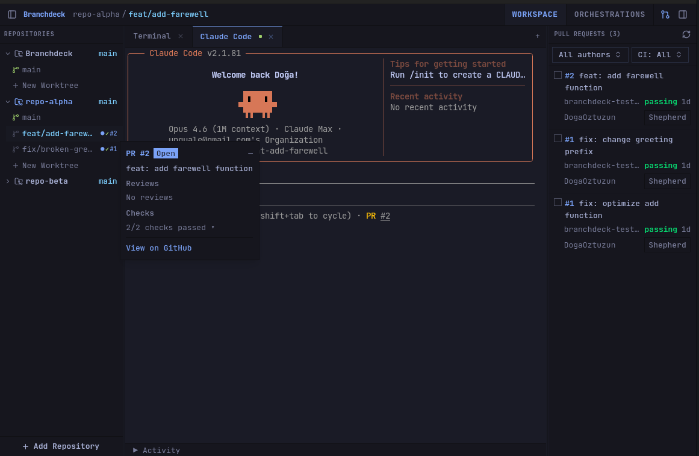

<div align="center">

# Branchdeck

**An agentic workspace for managing repos, worktrees, and coding sessions — that learns as you work.**

[](LICENSE)

**Linux-first** &nbsp;&bull;&nbsp; **Open Source** &nbsp;&bull;&nbsp; **Local-first** &nbsp;&bull;&nbsp; **Lightweight**

> **Alpha** — building in public. Expect rough edges.

</div>

<p align="center">
  
</p>

## What is Branchdeck?

A lightweight desktop app for working across multiple git repositories, worktrees, and coding sessions — with a knowledge layer that accumulates across everything you do.

Add your repos. Create worktrees. Open terminals. Launch Claude Code sessions. See PR status, file changes, branch tracking. All in one place, all at a glance.

What makes it different: every fix, every PR review, every resolved error feeds into a local knowledge store that spans your entire workspace. The next session in a different repo benefits from what was learned in the last one. Knowledge isn't trapped in one project — it compounds across all of them.

## The workspace

**Multi-repo, multi-worktree** — Add as many repos as you work with. Create worktrees for parallel branches. Each worktree gets its own terminal tabs, its own file status, its own context. No branch switching, no stashing.

**Embedded terminals** — Shell and Claude Code sessions per worktree. WebGL-rendered, PTY-backed. Launch a Claude Code session with a specific prompt, team config, or command.

**PR monitoring** — CI check status, review state, merge readiness — live in the sidebar. See which PRs need attention without opening GitHub.

**Cross-repo dashboard** — Everything across every repo in one view. What's active, what's waiting, what shipped, what failed.

**File status at a glance** — Visual dot grids showing modified, added, deleted, and conflicted files per worktree.

**Persistent** — Window state, repos, worktrees, active sessions — all restored on launch. Crash-proof. No cloud, no sync, no account.

## The knowledge layer

Branchdeck captures what happens across your workspace and turns it into reusable context:

- A PR review teaches a pattern → it's available in every repo, every worktree
- An error gets resolved → the resolution surfaces next time the same class of error appears
- A build/test pattern is established → new sessions in that repo start with that context
- Conventions emerge from commits and fixes → they carry forward automatically

Knowledge is stored locally with on-device vector embeddings (ONNX). It's scoped hierarchically — worktree, repo, global — so the right context surfaces at the right level. Sessions query it via MCP. Nothing leaves your machine.

This is the part that compounds. The workspace gets smarter the more you use it.

## Autonomous execution

Branchdeck doesn't just hold terminals — it drives them. Define what needs to happen, and Branchdeck creates the worktree, launches a session, monitors execution, and captures the result.

**Monday morning with Branchdeck:**

You come in Monday morning.

Six PRs across three repos:
- Two have failing CI
- One has review comments
- Three are waiting on rebases

You open Branchdeck, see the dashboard, and launch a run for each.

Each gets:
- Its own worktree
- Its own session
- Its own context

They work in parallel.

One reads the CI failure and pushes a fix.
Another addresses the review comments.
Another rebases and resolves conflicts.

You watch them all converge from one screen.

When they finish, Branchdeck captures every branch, commit, and PR link.

The knowledge layer absorbs what worked — **not just the code fixes**, but *how* you orchestrated them. Which runs you retried, which you cancelled, what prompts led to clean results.

Next time a similar CI failure shows up in any repo, the resolution is already there.

Next time you launch a similar workflow, Branchdeck has learned how you work.

## Powered by Claude Code

Branchdeck is built around [Claude Code](https://github.com/anthropics/claude-code). Every terminal session, every autonomous run, every knowledge capture flows through Claude Code as the execution engine. No abstraction layer, no multi-provider juggling — one deeply integrated executor.

## Tech stack

| | |
|:--|:--|
| **Desktop** | [Tauri v2](https://v2.tauri.app/) — Rust backend, daemon-ready service layer |
| **Frontend** | [SolidJS](https://www.solidjs.com/) + [Tailwind CSS v4](https://tailwindcss.com/) |
| **Terminal** | [xterm.js](https://xtermjs.org/) + WebGL + portable-pty |
| **Git** | [git2](https://docs.rs/git2) — in-process, no CLI shelling |
| **Knowledge** | ONNX Runtime — local vector embeddings, hierarchical vector store |
| **Components** | [Kobalte](https://kobalte.dev/) + solid-resizable-panels |

## Requirements

| | |
|:--|:--|
| **OS** | Linux (Ubuntu 22.04+) |
| **Rust** | [rustup](https://rustup.rs/) stable |
| **Bun** | [bun.sh](https://bun.sh/) v1.0+ |
| **System libs** | See below |

```bash
sudo apt-get install -y \
  libwebkit2gtk-4.1-dev \
  libjavascriptcoregtk-4.1-dev \
  libsoup-3.0-dev \
  libgtk-3-dev \
  libayatana-appindicator3-dev \
  librsvg2-dev
```

## Getting started

```bash
git clone https://github.com/DogaOztuzun/branchdeck.git
cd branchdeck
bun install              # Install frontend deps
bunx tauri dev           # Dev mode (hot reload + Rust rebuild)
bunx tauri build         # Production build
```

## Development

```bash
# Lint & format
bun run check              # Biome lint + format check
bun run check:fix          # Biome auto-fix
cargo clippy --all-targets # Rust linting (from src-tauri/)
cargo fmt --check          # Rust format check

# Tests (run before every commit/PR)
bun test                   # Frontend tests (vitest)
cargo test                 # Rust tests (from src-tauri/)
```

### Before committing

Run the full check suite — CI will reject PRs that fail any of these:

```bash
bun run check && bun test && cd src-tauri && cargo fmt --check && cargo clippy --all-targets -- -D warnings && cargo test
```

## Contributing

See [CONTRIBUTING.md](CONTRIBUTING.md) for setup, branch strategy, code standards, and PR guidelines.

## License

MIT
